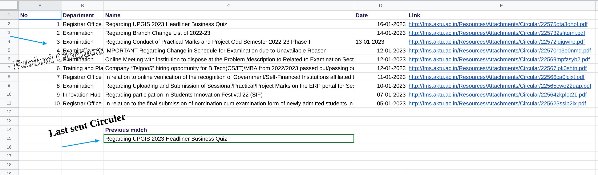

# AKTU_circular_bot
> Telegram bot to scrape latest aktu circulars to channel. This bot is hosted on google sheets and uses google sheets as a database to store the scraped data.

## How to use
 Link to telegram channel: [Join now :arrow_upper_right:](https://t.me/aktucirculars)

## Tech Stack
- JavaScript
- Telegram Bot API
- Cheerio
- Google Sheets(For storing scaped data and to hosting server)

## Setup
- Clone the repo
- Create a telegram bot using [BotFather](https://t.me/BotFather)
- Get the bot token
- Create a google sheet and go to `Tools` > `Script Editor`
   - sheets structure
   - 
- Paste the code from `FetchFromAktu.js` and `SendToTelegram.js` in the respective files
- Test the code
- Create a trigger to run the script after an interval of time.

## Contributing
Pull requests are welcome. For major changes, please open an issue first to discuss what you would like to change.

## Author
  **Abhishek** 
   

## License
[MIT](https://choosealicense.com/licenses/mit/)

## Acknowledgements
- [Telegram Bot API](https://core.telegram.org/bots/api)
- Cheerio Docs
- Google Sheets API Docs 